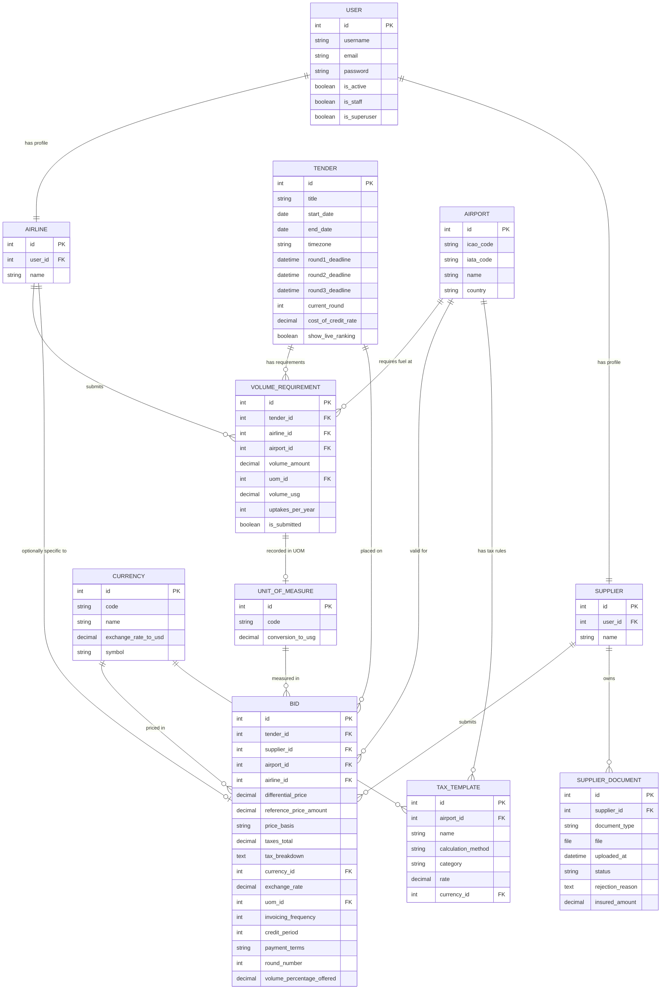

# Project Blueprint & System Architecture

This document provides a comprehensive overview of the **AFRAA Fuel Procurement System**'s tech stack, directory structure, file responsibilities, and database schema.

---

## 1. Technology Stack

*   **Backend Framework:** Python 3.13 / Django 6.0.1 (Robust MVC/MVT framework).
*   **API Toolkit:** Django REST Framework 3.16.1 (Provides API structures).
*   **Database (Production):** PostgreSQL (Neon Serverless PostgreSQL).
*   **Database (Local):** SQLite (Local file `db.sqlite3` for development environment).
*   **Database Interface Layer:** `dj-database-url` (Dynamic parsing of connection strings).
*   **Frontend Technologies:** HTML5, CSS3 (Vanilla styles, responsive grids), JavaScript.
*   **Styling Theme:** Custom aviation-themed styling in `aviation.css` (features specific colors, typography, tables, and forms designed for fuel tenders).
*   **Hosting/Infrastructure:** Vercel (Serverless Functions compute runtime, globally distributed CDN for static assets).

---

## 2. Project Directory Blueprint

Below is the directory structure layout showing where each component of the application is located:

```text
afraa_fuel_system/
│
├── .gitignore                  # Config file to prevent tracking of private/local files (venv, sqlite db, local assets)
├── .python-version             # Pins Vercel's Python runtime version to 3.13
├── BLUEPRINT.md                # This system architecture blueprint
├── MAINTENANCE.md              # Operations manual (local environment setup, run migrations, superusers)
├── manage.py                   # Django CLI utility for administrative tasks
├── requirements.txt            # Frozen python dependencies for installation in Vercel/local env
│
├── config/                     # Core Django configuration folder
│   ├── __init__.py
│   ├── asgi.py                 # ASGI configuration for async web server gateways (e.g. WebSockets)
│   ├── settings.py             # Main settings file (environment variables, databases, auth, static routing)
│   ├── urls.py                 # Top-level URL routing dispatcher
│   └── wsgi.py                 # WSGI configuration (main serverless handler entrypoint for Vercel)
│
├── procurement/                # Main application folder (fuel tender business logic)
│   ├── __init__.py
│   ├── admin.py                # Registers models with Django Admin dashboard
│   ├── apps.py                 # App configuration metadata
│   ├── Converters.py           # BidAnalyzer engine (standardizes bids across currencies and units of measure)
│   ├── forms.py                # Validation logic and form structures (User registration, volume submissions)
│   ├── middleware.py           # RoleAccessMiddleware (role-based page route access check: Airlines vs. Suppliers)
│   ├── models.py               # Database schemas and business entities definition
│   ├── tests.py                # Unit tests for business logic validation
│   ├── urls.py                 # App-level URL routing
│   ├── utils.py                # General helper utilities
│   ├── views.py                # Request-response logic (dashboards, volume submissions, bid analysis calculators)
│   │
│   ├── migrations/             # Database migration history files
│   │
│   ├── static/                 # Static asset folder
│   │   └── procurement/
│   │       └── css/
│   │           └── aviation.css  # Unified aviation styling theme rules (forms, cards, dashboard tables)
│   │
│   └── templates/              # HTML layout files
│       ├── procurement/
│       │   ├── airline_analysis.html     # Live ranking dashboard for Airlines
│       │   ├── analysis.html             # Master analytical view for AFRAA admin users
│       │   ├── bidForm.html              # Formal bid submission page for Suppliers
│       │   ├── dashboard.html            # Main entry dashboard routing to appropriate roles
│       │   ├── reports_insights.html     # Aggregated reports and analytics for admin users
│       │   ├── submit_volumes.html       # Annual fuel volume requirements form for Airlines
│       │   └── supplier_analysis.html    # Live ranking dashboard for Suppliers
│       └── registration/
│           ├── login.html                # User login page
│           ├── register.html             # User registration form (Airlines / Suppliers)
│           └── registration_pending.html  # Pending account activation message
│
└── scripts/                    # Maintenance & utility scripts
    └── remove_templatetags.py
```

---

## 3. Database Schema

The database consists of **configuration models** (currency, airports, taxes), **business actors** (users, airlines, suppliers), and **operation models** (tenders, volume requirements, bids, uploaded verification documents).

### Visually Represented ERD (Entity Relationship Diagram)



---

## 4. Key Architectural Patterns

### 1. Bid Standardization Engine (`Converters.py`)
Because suppliers submit bids in different currencies (e.g., USD, KES, EUR) and different Units of Measure (e.g., USG, Litres, Metric Tons), comparing them raw is impossible.
*   **The Engine:** The `BidAnalyzer` class parses the bidded differential price, reference price, and credit terms. It calculates payment financing costs (based on credit days and inflation indexes), standardizes currencies using the `ExchangeRate` model, standardizes volume using `UnitOfMeasure` constants, and computes a **Net Landed Cost** (per USG or selected target unit) for a normalized, fair, apples-to-apples comparison.

### 2. Role-Based Route Enforcement Middleware (`middleware.py`)
To prevent suppliers from viewing competitor bids, and airlines from accessing tender management, the custom `RoleAccessMiddleware` intercepts incoming requests:
*   Paths matching `/tender/<id>/bids/` are locked to verified **Suppliers** (with check logic requiring uploaded and approved validation files).
*   Paths matching `/tender/<id>/volumes/` are locked to registered **Airlines**.
*   Paths matching `/tender/<id>/analysis/` and reports are locked to **AFRAA Admins (Superusers)**.
